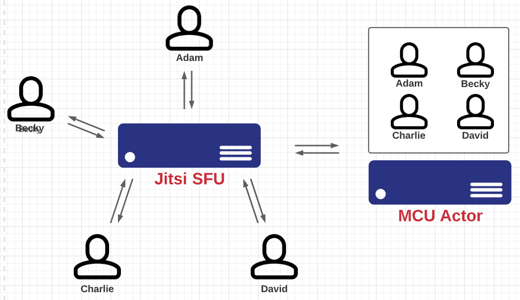

# Proposal for Jitsi Video Mixer

## Background

Currently the Jitsi Server is designed for a limited number of users.
Many of our churches have over 20+ members and some over 80 members.
The Jitsi software ware uses the SFU architecture as opposed to the 
MCU architecture which Zoom and Blue Jeans uses.

> https://webrtc.ventures/2020/12/webrtc-media-servers-sfus-vs-mcus/

### SFUs – Selective Forwarding Units

In this case, each participant still sends just one set of video and audio up to the SFU, like our MCU. However, the SFU doesn’t make any composite streams. Rather, it sends a different stream down for each user. In this example, 4 streams are received by each participant, since there are 5 people in the call. As you can see - bandwidth and CPU resources are now the responsibility of each participant.

### MCUs – Multipoint Control Units

Each peer in the group call establishes a connection with the MCU server to send up its video and audio. The MCU, in turn, makes a composite video and audio stream containing all of the video/audio from each of the peers, and sends that back to everyone. Bandwidth and CPU resources are reduced to the minimum required for each participant.

### Why is this important

Many of the members in our church have bandwidth limitations and this is especially 
true for the host members (moderators). Unfortunately the issue of limited 
bandwidth resources for the churches are not resolvable in the near future.
We have looked into other platforms that support the MCU architecture and
they are not a good fit for our needs. Instead we are looking into implementing 
SFU and MCU simultaneously in our Jitsi solution.

> Tldr; Jitsi requires too many streams per participant which becomes a real problem
> even for the moderators when the size of the church is larger then 15 members.

## Proposal

Instead of modifying the Jitsi architecture to use MCU, we will use a combination of both.
If we can introduce a silent participant in each meeting, we will have a way to siphon 
participant streams via a program that runs in the cloud with guaranteed high bandwidth resources
and merge them together into a single composite video stream. This allows us to use the flexibility of
SFU to decide and manage which streams each participant are allowed to see.

### Modification to Jitsi requires four parts...

1. Modify the Web UI to force participants including the moderator to see the moderator only (no gallery mode). This means that each participant will only have two streams - one from the moderator and one from their own webcam. This also requires the removal of the participant list thumbnail view. (Code has already been written for this. This is not included in the scope of work)
2. The "MCU Actor": Create a backend service which would act as a "MCU" participant that would login to each meeting and would have access to all the participant streams. An api would be created that would allow the moderator to select a given number of participants (either by checkbox (stage mode) or groups of 4/9/25 (per "page" - gallery mode) sorted alphabetically) and the streams of those selected would be merged into a single video stream. This stream would represent the "gallery mode" or "stage mode" that zoom/webex provides as functionality.
3. Front end for the MCU functionality: Create a front end web site to manage the MCU Actor. This front end would allow authenticated moderators to view the list of participants; select a number of participants that would appear on stage or select gallery mode that pages through a selected number of participants per page.
4. Allow the moderator replace the "MCU" stream or any other participants stream with its own stream so that users can view gallery of users or select a single or group of participants as presenter(s). (Code has already been written for this. This is not included in the scope of work)

## The MCU Actor Specifications

1. Written using rust (preferred) or C/C++.
2. Makefile for building the application from scratch is required - assume build server is a newly minted debian 10 machine with no dependencies installed other than the build-essential package.
3. This means the makefile must download/install the necessary dependencies including ffmpeg, rust, and cargo if necessary.
4. Client must be able to compile the application successfully with only the makefile and accompanying source code files from a git clone of a specified repo branch without developers help on a clean Amazon EC2 Debian install (GPU may be required).
5. WebRTC protocol is required due to limitations of Jitsi.
6. Must support GPU - all gpus supported by AWS EC2 are allowed.
7. Must support various input video resolutions - output default is 720p and allowed to change.
8. Must support various input video frame rates - output default is 25fps and allowed to change.
9. Must support various input video codecs - output will be H.264 subject to change.
10. Must support various input audio codecs - output will be mp3 subject to change.
11. Must allow participant's video resolution and frame rate to change over time.
12. Maximize participant video frame size in merged stream allowing for a minimally thick border with (around 5 to 10px lower the better) padding between frames. Programmer has discretion over the gallery layout however it must be approved by client.
13. Minimize latency as much as can be allowed.
14. Assume participants video stream will intermittently terminate or have data corruption in its video or audio stream. The participants video stream may change resolution or framerate periodically.
15. The actor must be able to gracefully shut down the stream and restart the stream automatically when the input stream become more stable. All unhandled errors in the video merge process should shutdown the stream and restart automatically.
16. Testing of the stability of the backend and front end MCU Actor process is the developers responsibility.
17. As many different scenarios that cause instability should be discovered by the developer and tested for the system's handling of those scenarios. All known scenarios should not cause the system to crash but at the very least the system should recover in an appropriately quick manner.
18. Must allow the names of participants to show or not show in the merged video stream.
19. Configured settings should be saved to an embedded database or local file to be restored in the next meeting.
20. The merged video stream should appear in the meeting under the participant name "Stage".
21. API Specifications: Programmer is responsible for creating pseudo swagger yaml document or postman collection. Programmer has discretion over request and response body shapes.
   1. Get: /participants
      1. Returns full list of participants sorted by Name asc/desc
      2. Allow filtering by muted/unmuted video, muted/unmuted audio
      3. Allow paging if paging info is requested via query string
         1. idx = Starting Index (not page number but absolute number)
         2. cnt = Maximum count per pages
         3. if starting index is missing or negative assume idx is zero
         4. if count is missing or negative assume count is infinite.
      4. Return paging info as part of response even if paging is not requested.
         1. Total Count
         2. Current Page (starts at one)
         3. Total Page Count
      5. Return full participant info - see [Get: /participants/{id}]
   2. Get: /participants/{id}  (Returns a single participant's properties)
      1. Participant ID
      2. Name (not required)
      3. VideoStatus (muted/unmuted,resolution,framerate,codec,speed)
      4. AudioStatus (muted/unmuted,codec,speed)
      5. WebRTC stream link
      6. StageStatus
      7. etc...
   3. Post: /stage/participants
      1. Merges the streams of the selected participants into a single stream.
      2. Request: {"ids":[id1, id2, id3]}
      3. This action should be asynchronous
      4. Important: Allow muted participants to show as an empty frame
   4. Get: /stage/participants
      1. Returns the list of participants that are staged.
      2. Should include the full set of properties of each participant.
   5. Patch: /stage/video
      1. Allow the moderator to mute/unmute the video
      2. Allow the moderator to change the default resolution
      3. Allow the moderator to change the default frame rate
      4. Allow the moderator to show/hide the names of the selected participants on the stage stream
   6. Get: /stage/video
      1. Returns the current mute state
      2. Returns the current resolution and frame rate

## The MCU Front End Specifications

1. The front end should be written using React with the Material UI library. If the developer is not comfortable with Material UI, Bootstrap may also be used.
2. Authentication: support OAuth2.0 - needs login page.
3. Authorization: support jwt tokens via cookies - the cookies can be created by a different web site.
4. Web site is stand alone not part of the Jitsi application but must be allowed to live under the same domain - a /mcu url prefix will be its root url.
5. Layout shall be two columns.
   1. Left column will show video feed of stage stream.
   2. Right column will show a scrollable participant list with a checkbox allowing for the selection of participants per stage.
6. A button shall be provided to update the stage video stream
7. A button shall be provided to change the selection of participants grouped 4/9/25 per page.
8. Buttons shall be provided to move the selection to the next/prev group page.
9. Buttons (or a check box) shall be provided to mute/unmute the video stream.
10. Buttons (or a check box) shall be provided to include / not include the moderator as part of the paged gallery mode.
11. When no participants are selected and a video stream update is requested - the stage video stream should be muted.
